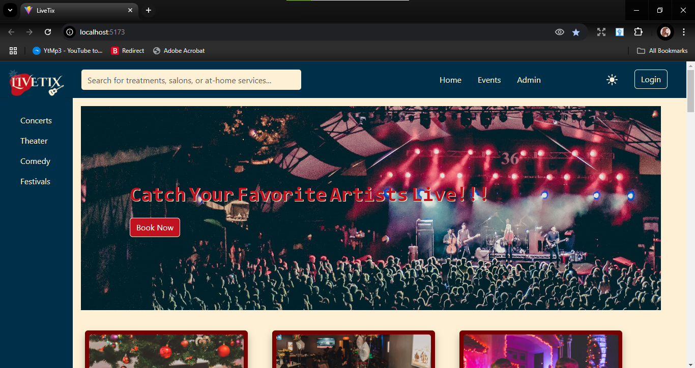
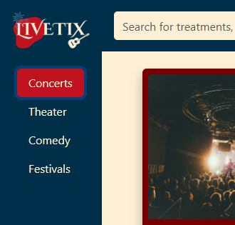
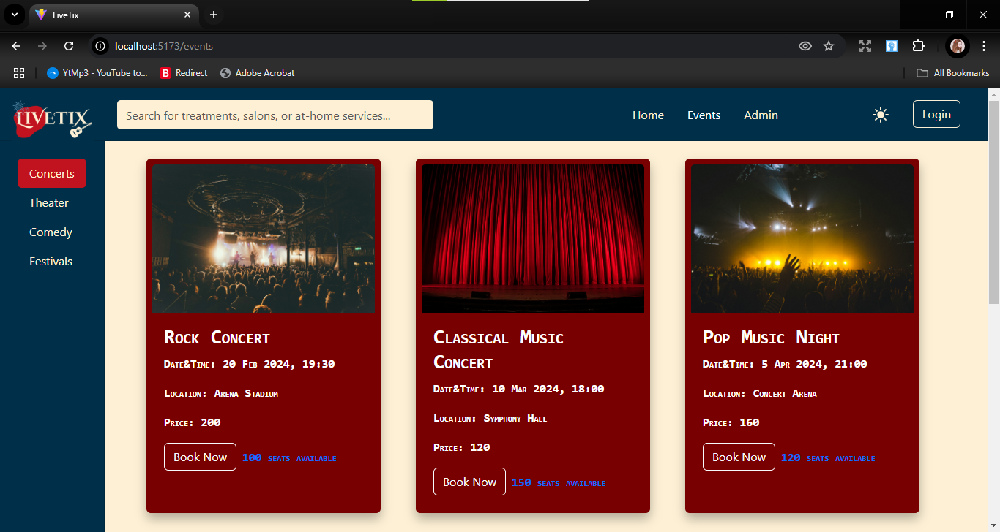
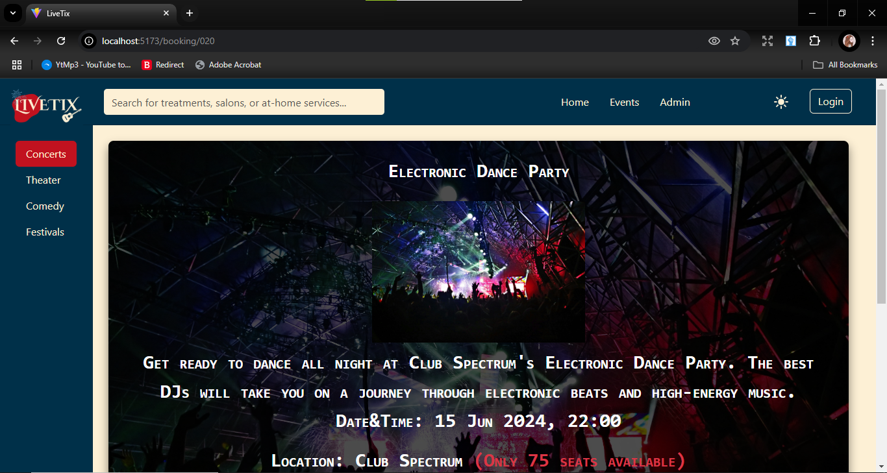
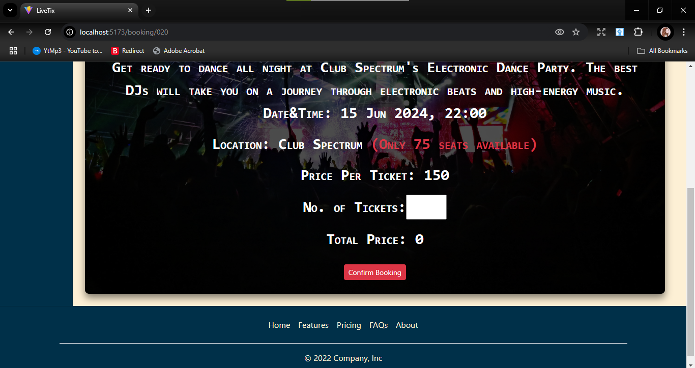
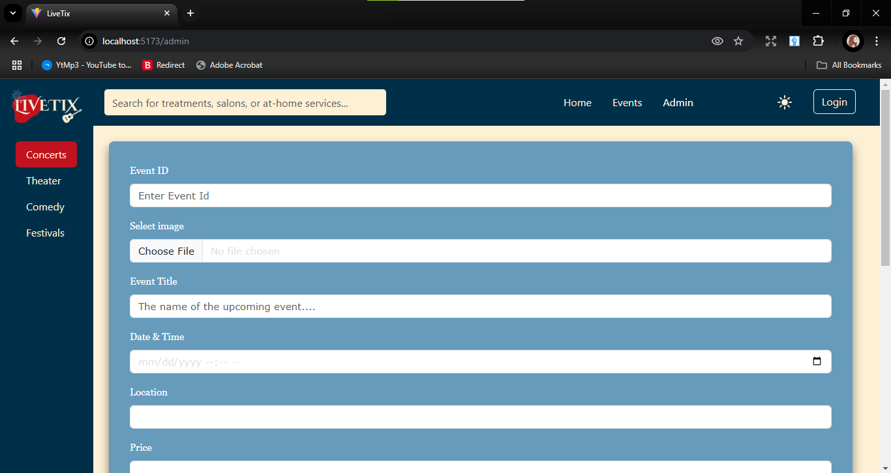
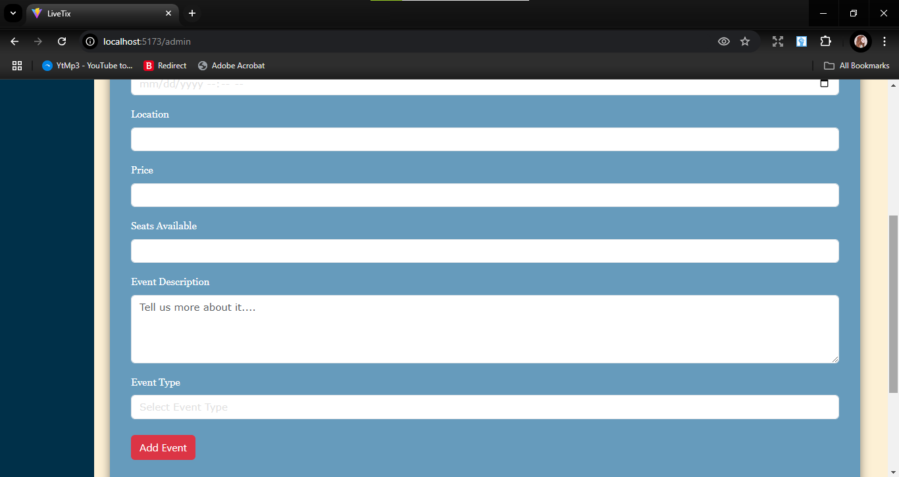
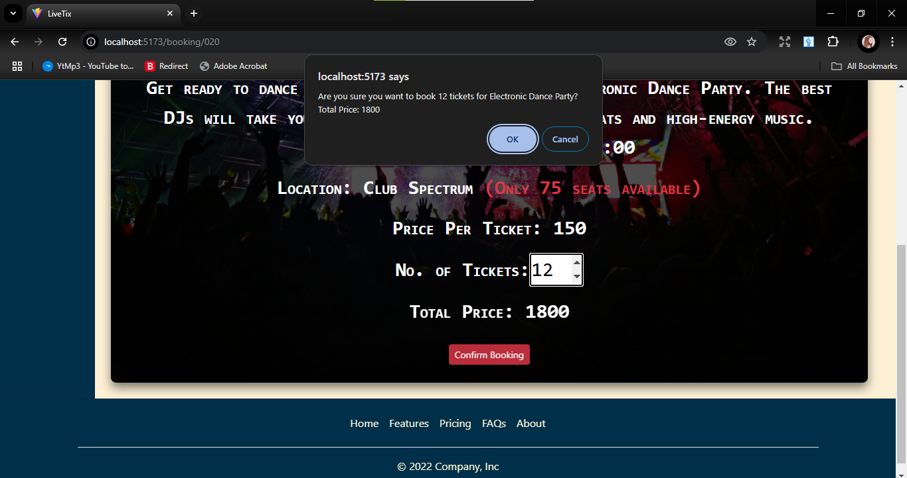

<h1>Livetix - Local Events Ticket Booking Platform</h1>
<h2>Project Description</h2>
Livetix is a modern ticket booking platform for local events, including:
🎭 Theater performances
🎶 Concerts
😂 Comedy shows
🌟 Festivals

The platform provides a seamless user experience with features like real-time seat selection, category filtering, and admin controls. Built with React and Redux, it ensures smooth navigation and state management while maintaining a sleek design with Bootstrap.

<h2>Technologies Used</h2>
ReactJS: For dynamic UI and efficient state management. 
Redux Toolkit: For advanced state management. 
React Router: For effortless navigation between pages. 
Bootstrap: For responsive design and UI components. 
HTML/CSS: For structuring and styling the website. 
<h2>Screenshots</h2>
Landing Page:

Category Sidebar:

Event Listings:

Event Details Page:

Admin Dashboard:

Booking Confirmation:

<h2>Video Demonstration</h2>
Watch the full demo on YouTube: 
